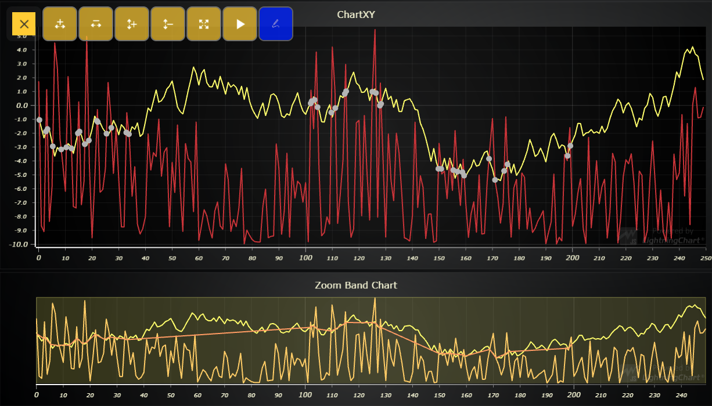
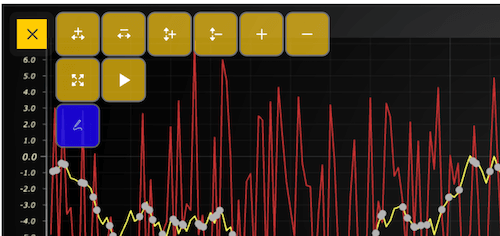

# JavaScript On Screen Menu



This demo application belongs to the set of examples for LightningChart JS, data visualization library for JavaScript.

LightningChart JS is entirely GPU accelerated and performance optimized charting library for presenting massive amounts of data. It offers an easy way of creating sophisticated and interactive charts and adding them to your website or web application.

The demo can be used as an example or a seed project. Local execution requires the following steps:

- Make sure that relevant version of [Node.js](https://nodejs.org/en/download/) is installed
- Open the project folder in a terminal:

        npm install              # fetches dependencies
        npm start                # builds an application and starts the development server

- The application is available at *http://localhost:8080* in your browser, webpack-dev-server provides hot reload functionality.


## Description

Example showcasing the use of On Screen Menu.

On-Screen Menu (OSM) is part of UI that can be used to simplify interaction with charts. 
In this case the default buttons are used along with a custom button that shows/hides the intersection points of lines.


The On-Screen menu can be added this way:

```javascript

const chart = lightningChart().ChartXY()

chart.addOnScreenMenu(
    [
        [
            // default buttnos
            OnScreenMenuButtonType.ZoomInX,
            OnScreenMenuButtonType.ZoomOutX,
            OnScreenMenuButtonType.ZoomInY,
            OnScreenMenuButtonType.ZoomOutY,
            OnScreenMenuButtonType.ZoomToFit,
            OnScreenMenuButtonType.ToggleAnimations,
        ],
    ],
    OnScreenMenuButtonShape.RoundedRectangle,
)

```

To add a custom button parameters must be defined.

```javascript

const chart = lightningChart().ChartXY()

chart.addOnScreenMenu(
    [
        [
          // cusrom button
          {
                icon: document.head.baseURI + 'examples/assets/9999/icon.png',
                dimensions: { rows: 1, columns: 1 },
                label: '',
                opacity: '0.8',
                color: 'blue',
                shape: OnScreenMenuButtonShape.RoundedRectangle,
                action: show,
            },
        ],
    ],
)

```

'addOnScreenMenu' takes an array of arrays as a parameter.
Each sub array adds a new line on the OSM menu.




```javascript

const chart = lightningChart().ChartXY()

chart.addOnScreenMenu(
    [
        [
            OnScreenMenuButtonType.ZoomInX,
            OnScreenMenuButtonType.ZoomOutX,
            OnScreenMenuButtonType.ZoomInY,
            OnScreenMenuButtonType.ZoomOutY,
            OnScreenMenuButtonType.ZoomIn,
            OnScreenMenuButtonType.ZoomOut,
        ],
        [
            OnScreenMenuButtonType.ZoomToFit,
            OnScreenMenuButtonType.ToggleAnimations,
        ],
        [
          {
              icon: document.head.baseURI + 'examples/assets/9999/icon.png',
              dimensions: { rows: 1, columns: 1 },
              opacity: '0.8',
              color: 'blue',
              shape: OnScreenMenuButtonShape.RoundedRectangle,
              action: show,
          },
        ],
    ],
)

```


Formula of lines intersection


```javascript

function calculateIntersection(currPoint1, prevPoint1, currPoint2, prevPoint2) {
       // Expressions of numerator
    const exp1 = currPoint1.x * prevPoint1.y - currPoint1.y * prevPoint1.x // (x1 * y2 - y1 * x2)
    const exp2 = currPoint2.x * prevPoint2.y - currPoint2.y * prevPoint2.x // (x3 * y4 - y3 * x4)

    const exp3 = currPoint2.x - prevPoint2.x // (x3 - x4)
    const exp4 = currPoint1.x - prevPoint1.x // (x1 - x2)
    const exp5 = currPoint2.y - prevPoint2.y // (y3 - y4)
    const exp6 = currPoint1.y - prevPoint1.y // (y1 - y2)

    // Denominator
    const d1 = (currPoint1.x - prevPoint1.x) * (currPoint2.y - prevPoint2.y) // (x1 - x2) * (y3 - y4)
    const d2 = (currPoint1.y - prevPoint1.y) * (currPoint2.x - prevPoint2.x) // (y1 - y2) * (x3 - x4)
    const d = d1 - d2

    if (d === 0) {
        throw new Error('Number of intersection points is zero or infinity.')
    }
    
    const px = (exp1 * exp3 - exp4 * exp2) / d
    const py = (exp1 * exp5 - exp6 * exp2) / d

    const p = { x: px, y: py }

    // Return point
    return p
}
```

## API Links

* [Point Series]
* [Line Series]
* [On Screen Menu]


## Support

If you notice an error in the example code, please open an issue on [GitHub][0] repository of the entire example.

Official [API documentation][1] can be found on [Arction][2] website.

If the docs and other materials do not solve your problem as well as implementation help is needed, ask on [StackOverflow][3] (tagged lightningchart).

If you think you found a bug in the LightningChart JavaScript library, please contact support@arction.com.

Direct developer email support can be purchased through a [Support Plan][4] or by contacting sales@arction.com.

[0]: https://github.com/Arction/
[1]: https://www.arction.com/lightningchart-js-api-documentation/
[2]: https://www.arction.com
[3]: https://stackoverflow.com/questions/tagged/lightningchart
[4]: https://www.arction.com/support-services/

© Arction Ltd 2009-2020. All rights reserved.


[Point Series]: https://www.arction.com/lightningchart-js-api-documentation/v3.4.0/classes/pointseries.html
[Line Series]: https://www.arction.com/lightningchart-js-api-documentation/v3.4.0/classes/lineseries.html
[On Screen Menu]: https://www.arction.com/lightningchart-js-api-documentation/v3.4.0/chartxy.html#addonscreenmenu

